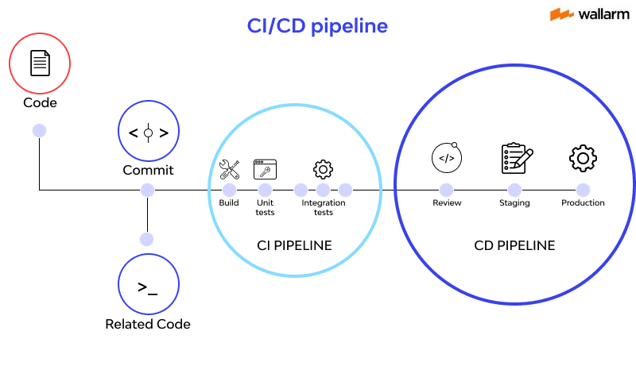

# Researchment Report by an Intern
## Git/ Repo Management -> Branch -> Pull Request

## Git commands

<strong> git commit -m "message": </strong> save changes in the repo's history 
<strong>git remote add origin <repo_url>: </strong> connect with remote repo  
<strong>git push origin main : </strong> push the commits  
<strong>git pull origin main :</strong> pull the latest version  
>
Branches in Git enable parallel development, allowing multiple features or bug fixes to be worked on simultaneously. They may be considered as parallel universes. Each branch holds a different version of the project. 

<strong> git branch new-feature:</strong>    Create a new branch 
<strong> git branch -d obsolete-branch: </strong>    Delete a branch 

### Branch types
<strong>main (or master): </strong> always stabilized, deployable code  <strong>develop: </strong> main developing space <strong>feature/*: </strong> branch to add new feature <strong>hotfix/*: </strong> to urgent bug fix  
### Branch operations
<strong>git push origin "new branch name" : </strong> send the updates to the new branch  
>at this point we have to make a "pull request" and merge the new branch with main branch 

<strong>git pull origin main: </strong> to update the main branch 
<strong>git merge feature/login: </strong>merge the branch after entering the main branch 

>In Gitlab we use "merge request" instead of "pull request"

## CI/CD (Continuous Integration and Continuous Delivery/Development)
These are considered as pipelines in Software Development Lifecycle which aim to streamline and accelerate the software.

**Continuous Delivery** = automated builds, tests, and deployments up to staging, but production requires manual approval.

**Continuous Deployment** = goes automatically into production after passing tests.

In programming, pipeline means a sequence of process steps where one step's output is another step's input.  
Depending on the desired aim, steps may vary. They are generally used in Data Process and Devops (CI/CD). 

### Why use pipelines?
<l>
  <li>Modular & Maintainable</li>
  <li>Scalable</li>
  <li>Automated & Repeatable</li>

</l>
 

> In data process pipelines are used for processing the data (e.g., validating, cleaning, enriching data) before storing or analyzing it.  

<strong>Continuous Integraton :</strong>
Within the shared repository, after each commit there is an automatically and frequently builds, tests and integrates the code 

<strong>Continuous Deploy/Development: </strong> If the code passes its tests, it will be automatically deployed to staging/production environment.  

Thus "push → test → quality control → deploy" process will be automated. Pipeline is not a code snippet itself, but rather an organizational concept. 

## How to implement pipeline?

<strong>UNIX/Linux: </strong> cat file **|** grep "abc" **|** sort 
<strong>Java /C#/C++ </strong> Chain of Responsibility or functional chains ( **map,  filter, reduce**)  
<strong>DevOps/GitLab/GitHub Actions: </strong> using YAML "**build, test, deploy**" steps can be defined. 

## Scheduler
Normally CI/CD triggers are: 
<li>push</li>
<li>pull/merge request</li>
<li>manual trigger</li>  

But with scheduler we can run the pipeline on specific times:
<li>Every night at 03.00 run build + test, write reports</li>  

This is particularly used for statics/quality reports.

> So, we can say these are preplanned triggers.

### How to implement scheduler into CI/CD pipelines?

If we are using GitHub, we have to use GitHub actions, in which YAML files differs. 
Although syntax varies according to each platform, the logic remains same: 
<li>Defining the pipeline steps (stages/jobs)</l> 
<li>Writing scripts for each step</l>
<li>Defining the cases -like case of push, with schedule, manual etc.</li> 

> All of them are defined with YAML/DSL files in the pipeline. To connect the scheduler we will use **cron**.

#### What is Cron?

It is scheduler for Linux and used to set the particular time. 
In CI/CD systems, cron expressions are used to define scheduled jobs (e.g., nightly builds, weekly reports). 
<code>* * * * * 
│ │ │ │ │ 
│ │ │ │ └── day of week (0-7) 
│ │ │ └──── month (1-12) 
│ │ └────── day (1-31) 
│ └──────── hour (0-23) 
└────────── minute (0-59)</code> 

**Examples:**

<l>
<li><code> 0  3 * * * </code> -> every day at 03.00</li>
<li><code> 30 8 * * 1 </code> -> every monday at 08.30
</l>

## Layers in a modular embedded project
 
<ol>
<li><strong>
Application layer: </strong>contains main logic of the system, defines expected behaviors of the device </li>
<li><strong>
HAL (Hardware Abstraction Layer): </strong>provides and interface between software and hardware </li>
<li><strong>
Middlware:</strong> provides reusable serviices and libraries, acts as a bridge betwen HAL and Application </li>
<li><strong>
Driver:</strong> directly controls hardware peripherals such as GPIO, UART etc.</li>
</ol>

 

## Static  libraries and code management

Compiling the frequently repeated codes in a format of either **.a** or **lib** file is called *static library*.  
They get included (linked) to project application in the compiling time and their runtime is independent. Once linked, the final executable no longer depends on them at runtime.  

#### *Properties*
<l>
<li> Can be created with <code>add_library(lib_name STATIC …) </code> which assembles the <strong>.c</strong> files together 
</li>
<li>With using <code>target_include_directories</code> headers could be opened as <strong> PUBLIC </strong>or <strong>PRIVATE </strong> </li>
<li>PUBLIC  -> includes both the library and the above layers that use it  </li>

<li> PRIVATE -> can be used only in the library</li>  

#### _example:_

<code>
add_library(driver STATIC gpio/gpio.c uart/uart.c)</code>  
this line creates a static lib called driver (probably one of the layers)  
here, <strong>gpio.c </strong> and <strong>uart.c </strong>  files are the source file of the said library  
 
<code>target_include_directories(driver PUBLIC ${CMAKE_CURRENT_SOURCE_DIR})
</code>  
this line gives the location information of 
<strong>driver lib's headers </strong>to the compiler  
since it has labelled as PUBLIC, it can be used by driver and the upper layer such as middleware or application

### Interface library
Interface is a special CMake target which is made out of only headers and compile options. It acts like a library during the compiling time. Thus other libraries and executables can access to the header files by linking this interface.  
<code> add_library(interfaces INTERFACE)  
target_include_directories(interfaces INTERFACE ${CMAKE_CURRENT_SOURCE_DIR}) </code>  

Since it doesn't contain any code (.c) files, we can use these libraries as a mid-layer in the hierarchies in order to maintain dependency from upper layer to lower layer.

> Normally, the application depends on the driver. But with interface libraries, we can invert dependencies: the driver can also depend on abstractions defined by the application (through interfaces), without creating circular dependencies.

